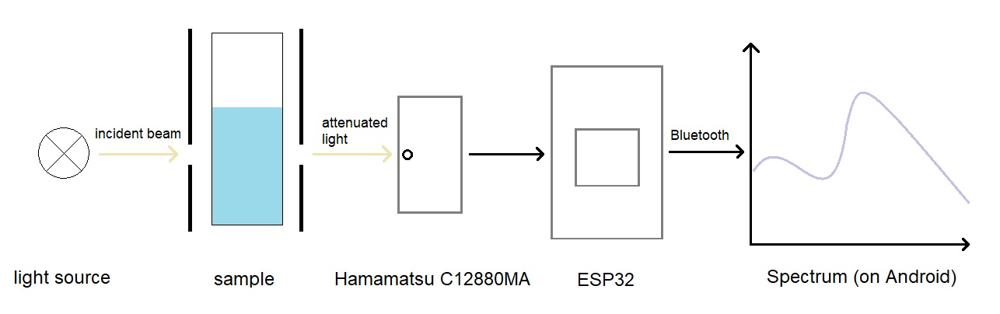

# Spectrophotometry

## About
This is an application designed to control an ESP32 based mini-spectrophotometer, process and visualize the
collected data.

### What is [Spectrophotometry](https://en.wikipedia.org/wiki/Spectrophotometry)?
Spectrophotometry is a branch of spectroscopy used for the quantitative analysis of molecules.
The analysis is based on the amount of light absorbed by colored compounds.
Measurements are carried out with a homemade, wireless Bluetooth device built to analyze the
light absorption of liquid samples in the visible range.
The results are stored and visualized, and the application is capable of determining unknown concentrations 
as well.

